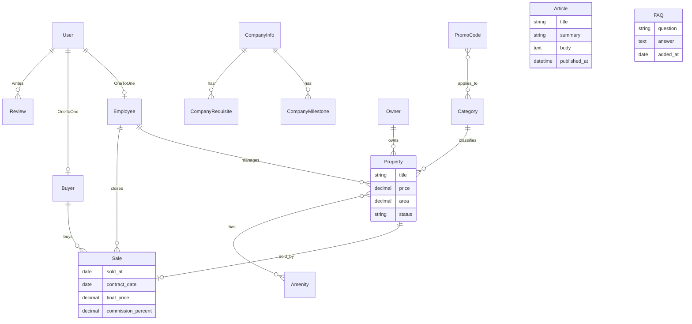

# ER-диаграмма

```mermaid
erDiagram
    User ||--o| Employee : "OneToOne"
    User ||--o| Buyer : "OneToOne"
    User ||--o{ Review : writes
    CompanyInfo ||--o{ CompanyMilestone : has
    CompanyInfo ||--o{ CompanyRequisite : has
    Category ||--o{ Property : classifies
    Owner ||--o{ Property : owns
    Employee ||--o{ Property : manages
    Employee ||--o{ Sale : closes
    Buyer ||--o{ Sale : buys
    Property ||--o| Sale : sold_by
    Property }o--o{ Amenity : has
    PromoCode }o--o{ Category : applies_to

    Article {
        string title
        string summary
        text body
        datetime published_at
    }
    FAQ {
        string question
        text answer
        date added_at
    }
    Property {
        string title
        decimal price
        decimal area
        string status
    }
    Sale {
        date sold_at
        date contract_date
        decimal final_price
        decimal commission_percent
    }
```
